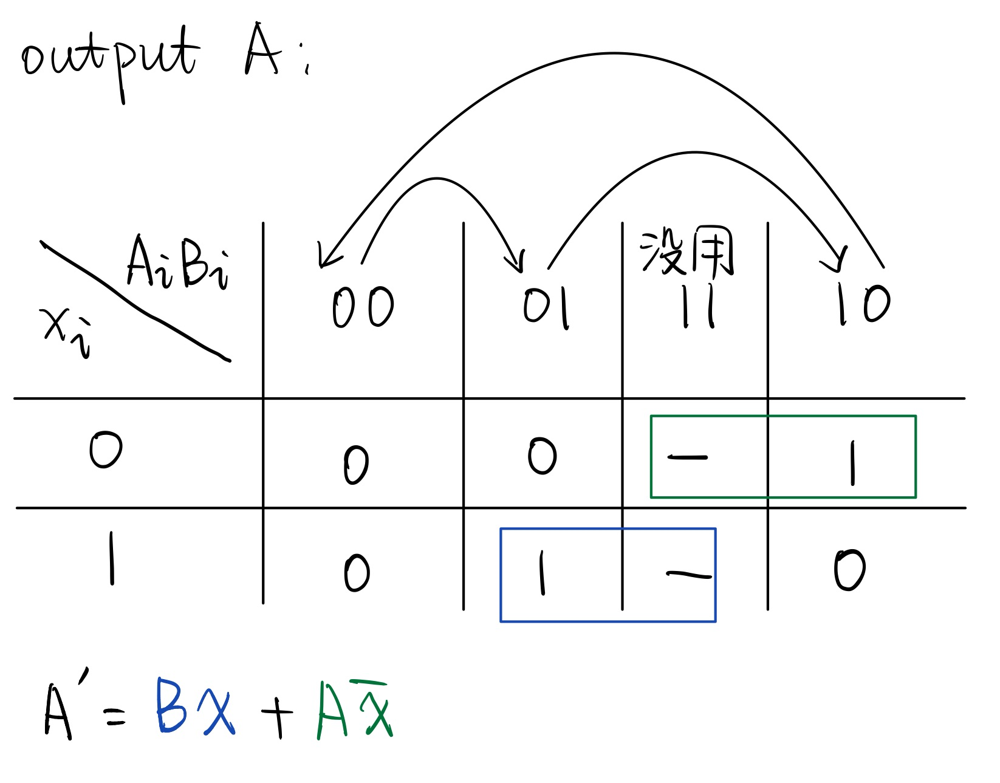
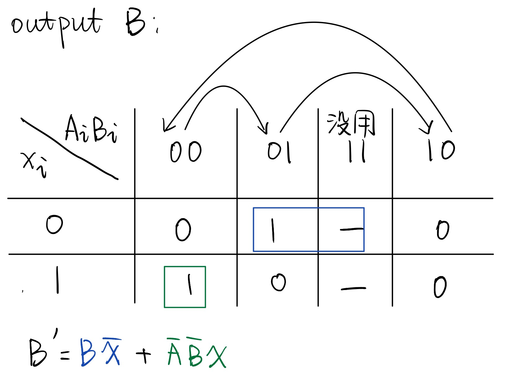

# 137. 只出现一次的数字 II

## 题目描述

这是LeetCode上的[137. 只出现一次的数字 II](https://leetcode-cn.com/problems/single-number-ii/)，难度为中等。


给定一个非空整数数组，除了某个元素只出现一次以外，其余每个元素均出现了三次。找出那个只出现了一次的元素。


### 示例1

```
输入：nums = [2,2,3,2]
输出：3
```


### 示例2

```
输入：nums = [0,1,0,1,0,1,99]
输出：99
```

### 数据范围

- $1\le nums.length\le 3\cdot 10^4$
- $-2^{31}\le nums[i]\le 2^{31}-1$
- `nums` 中，除某个元素仅出现 **一次** 外，其余每个元素都恰出现 **三次**

***


## 解答

### 1. HashMap

先用一个`HashMap`记录每个元素出现了多少次，然后遍历`HashMap`中的所有元素，查找哪个元素出现次数为1，返回答案即可。


#### **java版：**

在存`HashMap`的时候，对于新插入的元素，有两种写法：

- `map.put(x, map.getOrDefault(x, 0) + 1); `这样如果原来$x$不在哈希表中，就会返回值 0 
- `map.putIfAbsent(x, 0);   map.put(x, map.get(x) + 1);`  这样如果$x$原来不在哈希表中，就会先放入一个0。这种写法会稍微慢一点。


```Java
class Solution {
    public int singleNumber(int[] nums) {
        var map = new HashMap<Integer, Integer>();
        // 建立HashMap统计元素出现个数
        for (var x : nums) {
            map.put(x, map.getOrDefault(x, 0) + 1);
        }
        for (var key : map.keySet()) {
            // 返回出现一次的元素
            if (map.get(key) == 1) {
                return key;
            }
        }
        // 这里是不可能到达的
        return -1;
    }
}
```

#### **C++版：**

```cpp
class Solution {
public:
    int singleNumber(vector<int>& nums) {
        unordered_map<int, int> count;
        // 建立HashMap统计元素出现个数
        for (auto x : nums) {
            ++count[x];
        }
        for (auto pair : count) {
            // 返回出现一次的元素
            if (pair.second == 1) {
                return pair.first;
            }
        }
        // 这里是不可能到达的
        return -1;
    }
};
```

#### Python3版：

`Python` 统计出现次数就比较丝滑了，直接用`Counter()`函数就好.

```python
class Solution:
    def singleNumber(self, nums: List[int]) -> int:
        cnt = Counter(nums)		# 统计元素出现个数
        return [key for (key, val) in cnt.items() if val == 1]
```


* 时间复杂度$O(n)$, 空间复杂度$O(n)$.


### 2. HashMap

我们统计数字每一位出现了几个1，例如给定输入的二进制表示为

$0111, 1011, 1011, 1011$，

那么最低位(第1位)出现4个1，第二位出现4个1，第三位出现1个1，第四位出现3个1，这里记作$[4,4,1,3]$

由于其他数字都重复了三次，所以我们把所有位上出现1的次数对3取模，变成$[1,1,1,0]$

所以那个只出现1次的数字就对应第1~3位都为1，第4位为0


#### **java版：**


```Java
class Solution {
    public int singleNumber(int[] nums) {
        int[] cnt = new int[32];	// 存储每一位出现1的个数
        for (int i = 0; i < 32; ++i) {
            cnt[i] = 0;		// 最好初始化一下数组
        }
        for (var x : nums) {
            for (int i = 0; i < 32; ++i) {
                if (((x >> i) & 1) == 1) {	// 如果第i位是1，将对应位置cnt + 1
                    ++cnt[i];
                }
            }
        }
        int res = 0;
        for (int i = 0; i < 32; ++i) {
            // 将对3取模后为1的位数取出来，组合成新的数，就是答案
            if (cnt[i] % 3 == 1) {
                res += (1 << i);
            }
        }
        return res;
    }
}
```

#### **C++版：**

```cpp
class Solution {
public:
    int singleNumber(vector<int>& nums) {
        int cnt[32];	// 存储每一位出现1的个数
        memset(cnt, 0, sizeof(cnt));	// 最好初始化一下数组
        for (auto x : nums) {
            for (int i = 0; i < 32; ++i) {
                if (((x >> i) & 1) == 1) {	// 如果第i位是1，将对应位置cnt + 1
                    ++cnt[i];
                }
            }
        }
        int res = 0;
        for (int i = 0; i < 32; ++i) {
            // 将对3取模后为1的位数取出来，组合成新的数，就是答案
            if (cnt[i] % 3 == 1) {
                res += (1 << i);
            }
        }
        return res;
    }
};
```

#### Python3版：

这里需要注意，`Python`对**"有符号整数"**和**“无符号整数”**没有区分，那么可能会得到错误的答案。这是因为“**有符号整数**”的第31 位（最高位）是符号位，如果为1，表示该数为负数，而 **“无符号整数”**中第31位对应$2^{31}$, 并不用来表示符号。这样对于负数，就会给出错误的答案，例如：

输入：`[-2,-2,1,1,4,1,4,4,-4,-2]`， 如果不考虑最高位的问题，会输出：`4294967292`，而正确答案是`-4`。这是因为用补码表示的`-4`是`1111 1111 1111 1111 1111 1111 1111 1100 (0xFFFFFFFC)`, `Python`会将最高位的1当成$2^{31}$，直接转换成十进制数，就是`4294967292`. 

所以在这里，我们需要对最高位进行特殊判断，因为最高位的1实际上代表$-2^{31}$，所以如果是最高位，我们用减法而不是加法。

```python
class Solution:
    def singleNumber(self, nums: List[int]) -> int:
        cnt = [0] * 32		# 存储每一位出现1的个数
        for x in nums:
            for i in range(32):
                if ((x >> i) & 1) == 1:
                    cnt[i] += 1		# 如果第i位是1，将对应位置cnt + 1
        res = 0
        for i in range(31):
            # 将对3取模后为1的位数取出来，组合成新的数，就是答案
            if cnt[i] % 3 == 1:
                res += (1 << i)
        # 注意最高位，也就是 i = 31 时，用减法而不是加法
        if cnt[31] % 3 == 1:
            res -= (1 << 31)
        return res
```


* 时间复杂度$O(32n)=O(n)$, 空间复杂度$O(32)=O(1)$.


### 3. 位运算/数字电路真值表(可选)

在之前[136. 只出现一次的数字](./136.md)中，我们根据异或的性质$a\oplus b\oplus b = a$，也就是异或同一个数两次，相当于没异或那，我们将所有数异或到一起，最后结果就是只出现一次的数。

现在这道题我们需要找到一个“**类似异或**”的东西，满足$a\star b\star b\star b=a$, 也就是对同一个数操作三次之后，相当于没操作。那这时候我们就有了三种状态，让他们之间进行循环。更直观来说：

之前136那道题是，$1\Rightarrow 0 \Rightarrow 1\Rightarrow0, \cdots$，一直循环下去，两个一循环

而现在这道题是，$00\Rightarrow 01 \Rightarrow 10 \Rightarrow 00\Rightarrow 01\Rightarrow 10,\cdots$，一直循环下去，三个一循环(由于这里我们有三种状态，需要用两个二进制位来表示)

根据一些数字电路的知识，我们可以分别写出这两个位置的真值表，并用**K-Map**化简后，可以得到下面的表达式



我们用$A$来表示第一个二进制位，$B$来表示第二个二进制位，那么当$A$的第$i$位，$A_i$，以及$B$的第$i$位，$B_i$，遇到$x$的第$i$位$x_i$时，新的$A'$的第$i$位，根据这个真值表，可以表示成$A_i'=B_ix_i+A_i\overline{x}_i$, 那么对于所有位同时操作，就是$A'=Bx+A\overline{x}$.

同样，对于$B$位置的更新情况，有$B'=B\overline{x}+\overline{A}\ \overline{B}x$.



那么最后全算完之后，只被计算了一次的数，让对应位上的$AB$从00变成了01，所以返回最终$B$的值就是答案。

#### **java版：**

```Java
class Solution {
    public int singleNumber(int[] nums) {
        int a = 0, b = 0;
        for (var x : nums) {
            int tmp = a;	// 注意这里a更新完之后，b更新的时候还需要原来的a值，所以要储存一下
            a = (b & x) | (a & ~x);
            b = (b & ~x) | (~tmp & ~b & x);
        }
        return b;	// b就是最后的答案
    }
}
```

#### **C++版：**

```cpp
class Solution {
public:
    int singleNumber(vector<int>& nums) {
        int a = 0, b = 0;
        for (auto x : nums) {
            int tmp = a;		// 注意这里a更新完之后，b更新的时候还需要原来的a值，所以要储存一下
            a = (b & x) | (a & ~x);
            b = (b & ~x) | (~tmp & ~b & x);
        }
        return b;	// b就是最后的答案
    }
};
```

#### Python3版：

```python
class Solution:
    def singleNumber(self, nums: List[int]) -> int:
        a = 0
        b = 0
        for x in nums:
            a, b = (b & x) | (a & ~x), (b & ~x) | (~a & ~b & x)
        return b;	# b就是最后的答案
```


* 时间复杂度$O(n)$, 空间复杂度$O(1)$.


